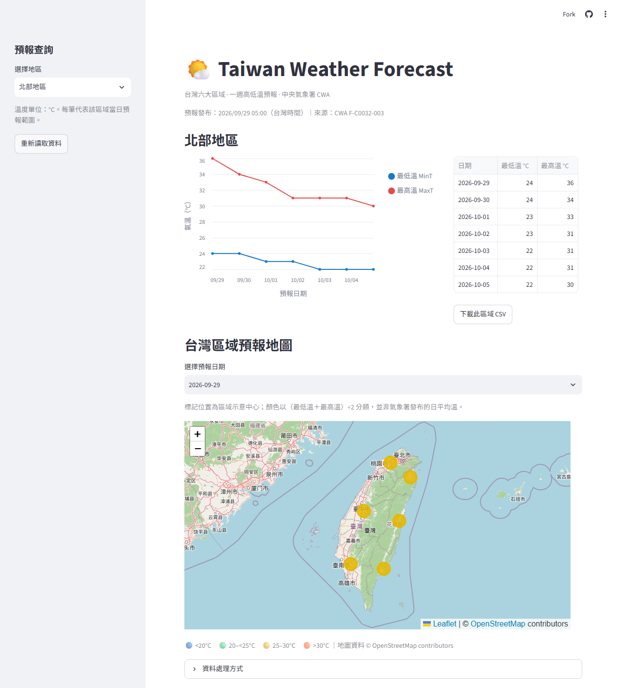

[開啟氣象預報網站](https://hw10-taiwan-weather-yenkai.streamlit.app/)



[GitHub 原始碼](https://github.com/A0966411725-png/HW10-Taiwan-Weather)

# HW10｜Taiwan Weather Forecast

台灣六大區域的一週氣溫預報網站。使用中央氣象署 JSON 資料，經 Python 整理後存入 SQLite，再由 Streamlit 透過 SQL 查詢，呈現每日最高／最低溫折線圖、表格與台灣地圖。

## 功能

- 北部、中部、南部、東北部、東部、東南部地區切換。
- 七天最低溫 MinT／最高溫 MaxT 折線圖、表格與 CSV 下載。
- 選擇預報日期，在 Folium 地圖查看各區溫度範圍。
- SQLite 唯一鍵與交易保護，重複匯入不產生重複資料，失敗時保留原資料。
- 顯示預報發布時間，資料超過 24 小時會提醒使用者。

## 作業實作流程

1. **取得 API（20%）：** 使用 requests 取得 CWA 一週區域預報 JSON，金鑰由環境變數讀取。
2. **解析 JSON（20%）：** 依地區、預報日期配對高低溫，驗證六區各有七天完整資料。
3. **儲存 SQLite（20%）：** 寫入 TemperatureForecasts，使用 SQL 列出地區並查詢選定地區資料。
4. **Streamlit（40%）：** 提供地區下拉選單、雙線折線圖與七天資料表；畫面只從 SQLite 讀取，不直接呼叫氣象 API。
5. **選做地圖：** 使用 Folium／OpenStreetMap，按日期顯示六區高低溫，不需要 Windy 金鑰。

開發採自然語言與 Codex 協作：先拆解評分項目，再建立資料擷取、解析、資料庫與介面，最後以自動測試及實際 CWA 資料驗證。AI 協助撰寫與修正程式，實作結果以程式、測試及資料查詢結果核對。

## 資料來源

[中央氣象署一週區域天氣預報 F-C0032-003](https://opendata.cwa.gov.tw/dataset/forecast/F-C0032-003)。

作業圖片中的 F-A0010-001 實測回傳 404，因此使用可取得六大區域一週預報的 F-C0032-003。實際 JSON 路徑為：

```text
cwaopendata → Dataset → Locations → Location[]
  → LocationName
  → WeatherElement[] → Time[]
    → StartTime
    → ElementValue.MinTemperature / MaxTemperature
```

將 MinTemperature／MaxTemperature 對應成 mint／maxt，以預報時段起始日期配對；若同日有多個時段，取最低的 MinT 與最高的 MaxT。

## 安裝與執行

建議使用 Python 3.12 或 3.13。Windows PowerShell：

```powershell
python -m venv .venv
.\.venv\Scripts\python.exe -m pip install -r requirements.txt
.\.venv\Scripts\python.exe -m streamlit run app.py
```

儲存庫附有實際 CWA 預報的 SQLite 與 CSV 快照，可直接啟動；請留意頁面上的發布時間。

### 更新氣象資料

將 [.env.example](.env.example) 複製為 `.env`，填入自己的 `CWA_API_KEY`，執行：

```powershell
.\.venv\Scripts\python.exe update_weather.py
```

亦可依作業流程分步執行：

```powershell
.\.venv\Scripts\python.exe fetch_weather.py
.\.venv\Scripts\python.exe parse_weather.py
.\.venv\Scripts\python.exe database.py
```

更新程式與 Streamlit 分離。網頁上的「重新讀取資料」只重新查詢資料庫。

## 資料庫設計

```sql
CREATE TABLE TemperatureForecasts (
  id INTEGER PRIMARY KEY,
  regionName TEXT NOT NULL,
  dataDate TEXT NOT NULL,
  mint REAL NOT NULL,
  maxt REAL NOT NULL,
  UNIQUE(regionName, dataDate),
  CHECK(mint <= maxt)
);

SELECT DISTINCT regionName FROM TemperatureForecasts;
SELECT * FROM TemperatureForecasts WHERE regionName = '中部地區';
```

每次成功匯入會以單一交易替換目前預報期，共 42 筆；不混用不同發布版本。程式查詢使用 SQL 參數，避免將使用者輸入直接拼入 SQL。

## 測試

```powershell
.\.venv\Scripts\python.exe -m unittest discover -s tests -v
```

驗證六區七天資料、日期配對、缺值與異常值、重複匯入、SQL 參數查詢，以及匯入失敗時交易回復。

## 部署與資料更新

使用 Streamlit Community Cloud 時，選擇此 GitHub 儲存庫、`main` 分支及 `app.py`，Python 選擇 3.12。

GitHub Actions 提供每六小時的更新流程，也可手動執行。需在 Repository secrets 設定 `CWA_API_KEY`，流程才可抓取新資料並更新資料庫；未設定時仍可展示附帶的快照，但不會自動產生新預報。排程可能因平台負載或儲存庫閒置而延後。

## 檔案結構

| 檔案 | 用途 |
| --- | --- |
| [fetch_weather.py](fetch_weather.py) | 取得 CWA JSON |
| [parse_weather.py](parse_weather.py) | 配對日期並整理高低溫 |
| [database.py](database.py) | SQLite 儲存與 SQL 查詢 |
| [update_weather.py](update_weather.py) | 一次執行資料更新 |
| [app.py](app.py) | Streamlit 互動網站 |
| [data.db](data.db) | 最新匯入的預報資料庫 |
| [weather_data.csv](weather_data.csv) | 可檢視的整理結果 |
| [tests/test_forecast.py](tests/test_forecast.py) | 資料與資料庫測試 |

## 使用說明

預報資料不等於實際觀測。地圖標記為區域示意中心，色階使用高低溫中點，不代表氣象署發布的日平均溫。資料庫保留最近一次預報版本，不提供歷史預報查詢。API 金鑰與原始設定檔不公開上傳。
